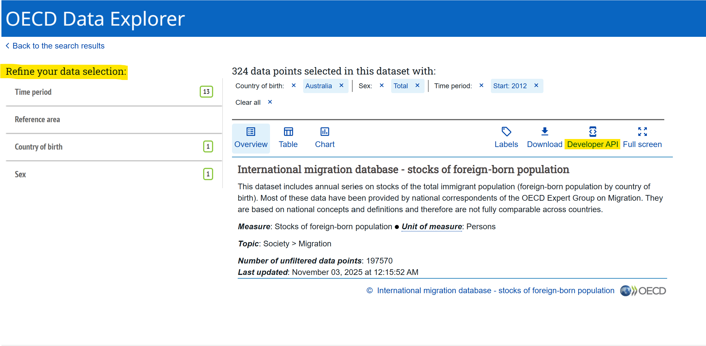
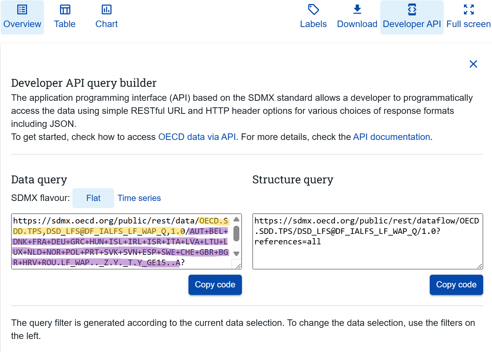

# What is the OECD?

The Organisation for Economic Co-operation and Development (OECD) is an international organisation that provides data and research aimed at finding solutions to social, economic, and environmental challenges. It is one of the world's largest and widely used sources of comparative data [^1].

[^1]: <https://www.oecd.org/en/about/how-we-work.html> ; <https://www.oecd.org/en/about.html>

# How to import data from the OECD to R

This post provides a step-by-step guide to importing datasets from the OECD into R using the OECD package, from locating a dataset in the OECD Data Explorer to preparing the data for analysis and creating simple graphs.

To make it clear which parts are universal across datasets and which may vary, the full process is demonstrated twice: once using a migration dataset and once using an unemployment dataset. The two examples are presented side by side, with each step first shown for the migration data and then repeated for the unemployment data.

## Step 1: Install and load the necessary packages

First you need to install and load the OECD package[^2], which allows you to retrieve data directly from the OECD API into R. You will also need to load the tidyverse package.

[^2]: The OECD package: <https://github.com/expersso/OECD>

```{R}
#| message: false
#| warning: false

#devtools::install_github("expersso/OECD")
library(OECD)

library(tidyverse)

```

## Step 2: Find a dataset using the OECD Data Explorer

The OECD Data Explorer provides access to a wide range of data, including topics such as employment, migration, international trade, and economic outlook [^3]. The datasets are sorted by category, and it is also possible to search for specific topics using keywords.

[^3]: The OECD Dataset Explorer: <https://data-explorer.oecd.org/>

{width="800"}

The datasets included in this tutorial are the *International migration dataset* [^4] and the *Labour force participation rate* dataset [^5]

[^4]: *International migration database* dataset: <https://data-explorer.oecd.org/vis?df%5Bds%5D=DisseminateFinalDMZ&df%5Bid%5D=DSD_MIG%40DF_MIG&df%5Bag%5D=OECD.ELS.IMD&dq=.W.A.B11._T...&pd=2012%2C&to%5BTIME_PERIOD%5D=false>

[^5]: *Labour force participation rate* dataset: <https://data-explorer.oecd.org/vis?df%5Bds%5D=dsDisseminateFinalDMZ&df%5Bid%5D=DSD_LFS%40DF_IALFS_LF_WAP_Q&df%5Bag%5D=OECD.SDD.TPS&df%5Bvs%5D=1.0&pd=%2C&dq=.LF_WAP.._Z.Y._T.Y15T64..Q&to%5BTIME_PERIOD%5D=false>

## Step 3: Import the dataset into R

{width="800"}

The next step, once you have found a dataset, is to filter the data under the "Refine your data selection".

In both examples below, only European countries were selected under *Reference area* (these must be chosen manually one by one). For *Sex*, only "Total" was selected. The filters included under "Refine your data selection" vary between datasets, so your selection may differ depending on which dataset you use.

It is important not to select overlapping categories, because doing so can lead to the same observations being included multiple times. For example, in the *Labour force participation rate* dataset, choosing both "15 years or over" and "From 15 to 54 years" would cause all respondents aged 15-54 to be included twice. A similar issue occurs in the *International migration dataset* when filtering by citizenship if you select both individual countries one by one and "World", as "World" already represents a selection of all countries.

After refining the data selection, copy the links provided under *Developer API* into R. You will need two links: one containing information about what dataset you want, and one containing information about what filters you just refined by. Below, the dataset link is highlighted in yellow (between / and /), and the filters link is highlighted in purple (between / and ?). These two links will allow you to import the dataset into R with the selected filters.

{width="800"}

### Import Migration dataset

Back in R after filtering the data in the Data Portal, you first have to paste both the dataset ID link and the filter link you just found under *Developer API* into R:

```{R}
dataset_mig <- "OECD.ELS.IMD,DSD_MIG@DF_MIG,1.0"

filter_mig <- "BEL+CZE+DNK+EST+FIN+FRA+DEU+GRC+HUN+ISL+IRL+ITA+JPN+LVA+LTU+LUX+NLD+NOR+POL+PRT+SVK+SVN+ESP+SWE+CHE+TUR+GBR+ISR+AUT.W.A.B11._T..."
```

Next, import the dataset using the `get_dataset()` function that comes with the *OECD* package:

```{R}
migdat <- labelled::unlabelled(get_dataset(dataset_mig, filter_mig))
```

### Import unemployment dataset

Now, we do the exact same thing for the unemployment data. Paste the links from the *Developer API* into R:

```{R}
dataset_unemp <- "OECD.SDD.TPS,DSD_LFS@DF_IALFS_UNE_Q,1.0"

filter_unemp <- "AUT+BEL+CZE+DNK+EST+FIN+FRA+DEU+GRC+HUN+ISL+IRL+ITA+LVA+LTU+LUX+NLD+NOR+PRT+POL+SVK+SVN+ESP+SWE+CHE+GBR+TUR.UNE.._Z.Y._T.Y_GE15..A"
```

Then, import the dataset with the selected filters:

```{R}
unemp <- labelled::unlabelled(get_dataset(dataset_unemp, filter_unemp))
```

## Step 4: Data cleaning

### Retrieving a dataset with variable information and merging

#### Migration dataset

Some of the variables in the dataset might not make sense at first glance. For example, in the *migdat* dataset the variable `MEASURE` has a value called "B11", which is not very informative on its own.

To understand what these codes mean, we can fetch a "data structure". Use the `get_data_structure()` function on the dataset ID:

```{R}
data_structure_migdat <- get_data_structure(dataset_mig)
```

Next, inspect the variable names in both the data structure and the main dataset:

```{R}
str(data_structure_migdat, max.level = 1) # the data structure

str(migdat) # the actual dataset
```

We can check how the values in the `MEASURE` and `UNIT_MEASURE` variables are coded:

```{R}
unique(migdat$MEASURE) 

unique(migdat$UNIT_MEASURE) 
```

What does "B11" and "PS" mean? To find out, we will merge the labels from the data structure into our main dataset.

First, we rename the variables in the data structure so that they match the variable names in our main dataset. This is necessary in order to merge the two datasets correctly.

In the data structure, information about the `MEASURE` variable is found within the `CL_MEASURE_MIG` variable. Here, you can see "B11" and what that actually means.

To be able to merge the data structure with the actual dataset, the column names must be identical in both datasets. We rename the first column in `CL_MEASURE_MIG` to `MEASURE`, so that it matches the main dataset.

We then rename the second column to `MEASURE_LBL`. This new column will contain the information about the code - what "B11" actually mean.

We repeat the same steps with the `UNIT_MEASURE` variable:

```{R}
names(data_structure_migdat$CL_MEASURE_MIG) <- c("MEASURE", "MEASURE_LBL") 

names(data_structure_migdat$CL_UNIT_MEASURE) <- c("UNIT_MEASURE", "UNIT_MEASURE_LBL") 
```

Now, we merge the data structure into the main dataset. This adds two new variables: `MEASURE_LBL` and `UNIT_MEASURE_LBL`.

```{R}
migdat <- migdat %>%
  merge(data_structure_migdat$CL_MEASURE_MIG, by = "MEASURE", all.x = TRUE) %>%
  merge(data_structure_migdat$CL_UNIT_MEASURE, by = "UNIT_MEASURE", all.x = TRUE)
```

You can now see that the two new explanatory variables have been added to the original dataset:

```{R}
str(migdat)
```

#### Unemployment data

Now, repeat the same steps as above with the unemployment dataset.

First, fetch the data structure:

```{R}
data_structure_unemp <- get_data_structure(dataset_unemp)
```

Then you check the names of the variables in both the data structure and the original dataset:

```{R}
str(data_structure_unemp, max.level = 1)

str(unemp)
```

Check how the values in the `MEASURE` and `UNIT_MEASURE` variables are coded:

```{R}
unique(unemp$MEASURE) 

unique(unemp$UNIT_MEASURE) 
```

Rename the variables:

```{R}
names(data_structure_unemp$CL_MEASURE_LFS_TPS) <- c("MEASURE", "MEASURE_LBL") 

names(data_structure_unemp$CL_UNIT_MEASURE) <- c("UNIT_MEASURE", "UNIT_MEASURE_LBL")
```

Finally, merge the data structure into the original dataset:

```{R}
unemp <- unemp %>%
  merge(data_structure_unemp$CL_MEASURE_LFS_TPS, by = "MEASURE", all.x = TRUE) %>%
  merge(data_structure_unemp$CL_UNIT_MEASURE, by = "UNIT_MEASURE", all.x = TRUE)
```

### Filter the dataset

The next step is to select the relevant variables from the dataset. At the same time, we transform the `TIME_PERIOD` to a numeric variable.

#### Migration dataset

```{R}
migdat <- migdat %>%
  select(ObsValue, MEASURE, OBS_STATUS, REF_AREA, TIME_PERIOD) %>%
  mutate(TIME_PERIOD = as.numeric(TIME_PERIOD),
         ObsValue = as.numeric(ObsValue))
```

Before doing any analysis, you should double check which years are included in the dataset. Even though you might have selected specific years when filtering the data in the OECD Data Portal, this selection does not always work. If there are years you do not want, you remove them by filtering the dataset to include only the years you want.

Below, we filter to only include the years from 2000 to 2023:

```{R}
table(migdat$TIME_PERIOD) 

migdat <- migdat %>%
  filter(TIME_PERIOD %in% 2000:2023)

table(migdat$TIME_PERIOD) 
```

#### Unemployment dataset

Now we do the same steps for the unemployment dataset.

First, filter the dataset to keep only the relevant variables and make the necessary transformations:

```{R}
unemp <- unemp %>%
  select(ObsValue, MEASURE, OBS_STATUS, REF_AREA, TIME_PERIOD) %>%
  mutate(TIME_PERIOD = as.numeric(TIME_PERIOD),
         ObsValue = as.numeric(ObsValue))
```

Next, check which years are included and filter the dataset to only include the years you want:

```{R}
table(unemp$TIME_PERIOD) 

unemp <- unemp %>%
  filter(TIME_PERIOD %in% 2000:2023)

table(unemp$TIME_PERIOD)
```

## Step 4: Use the data

Now that the datasets are imported and cleaned, you can start using them. In this section, we will create a few simple graphs.

When making graphs with large numbers (e.g. population measurements), the numbers can appear in scientific notation. To prevent this, use:

```{R}
options(scipen = 999)
```

### Migration dataset

One useful graph is a simple bar graph showing the average inflow of the foreign population for each country over the period 2000–2023:

```{R}
migdat %>%
  filter(MEASURE == "B11") %>%
  group_by(REF_AREA) %>%
  summarize(avg_inflow = mean(ObsValue, na.rm = T)) %>%
  ggplot(aes(x = avg_inflow, y = reorder(REF_AREA, avg_inflow))) +
  geom_col() +
  labs(x = "", y = "", title = "Average inflow of foreign population (2000-2023)") +
  theme_bw()
```

You can also create a line graph to see trends over time for selected countries. Choose the countries you are interested in:

```{R}
migdat %>%
  filter(REF_AREA %in% c("DNK","SWE","NOR","FIN")) %>%
  ggplot(aes(x = TIME_PERIOD, y = ObsValue, group = REF_AREA, color = REF_AREA)) +
  geom_line(linewidth = 1) +
  scale_color_brewer(palette = "Paired") + # Colour blind friendly palette
  scale_x_continuous(breaks = seq(2000,2025,2)) +
  scale_y_continuous(breaks = seq(0, 150000, 25000)) +
  labs(y = "", x = "", color = "Country",
       title = "Inflows of foreign population") +
  theme(legend.position = "bottom") +
  theme_bw()
```

### Unemployment dataset

Similarly, you can create a bar graph showing the average unemployment level for each country over the period 2000–2023:

```{R}
unemp %>%
  filter(MEASURE == "UNE") %>%
  group_by(REF_AREA) %>%
  summarize(avg_unemp = mean(ObsValue, na.rm = T)) %>%
  ggplot(aes(x = avg_unemp, y = reorder(REF_AREA, avg_unemp))) +
  geom_col() +
  labs(x = "", y = "", title = "Average unemployment level (2000-2023)") +
  theme_bw()
```

And a line graph showing unemployment trends over time for selected countries:

```{R}
unemp %>%
  filter(REF_AREA %in% c("DNK","SWE","NOR","FIN")) %>%
  ggplot(aes(x = TIME_PERIOD, y = ObsValue, group = REF_AREA, color = REF_AREA)) +
  geom_line(linewidth = 1) +
  scale_color_brewer(palette = "Paired") + 
  scale_x_continuous(breaks = seq(2000,2025,2)) +
  scale_y_continuous(breaks = seq(0, 150000, 25000)) +
  labs(y = "", x = "", color = "Country",
       title = "Unemployment trends") +
  theme(legend.position = "bottom") +
  theme_bw()
```

You should now be able to find and use OECD data independently - good luck!
